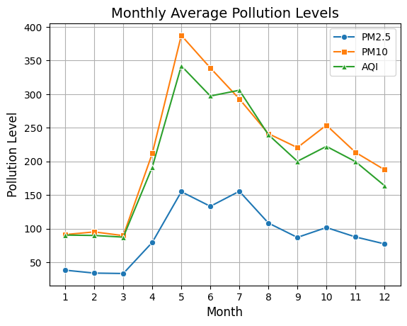
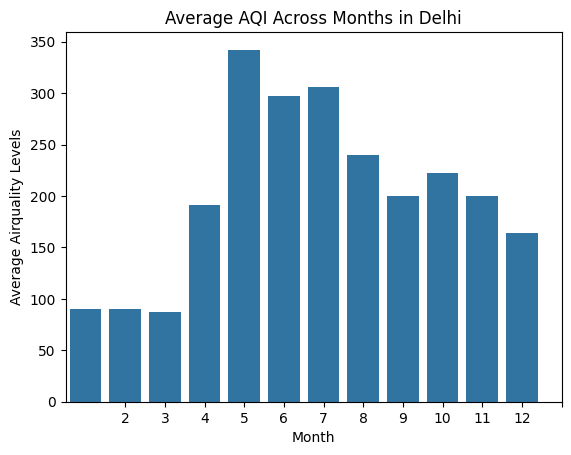
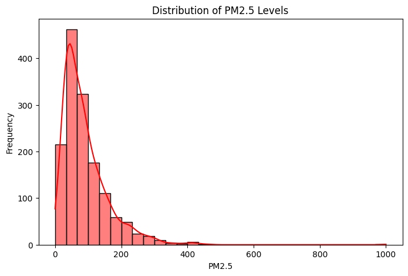
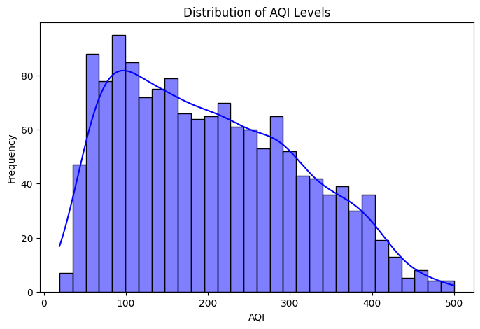
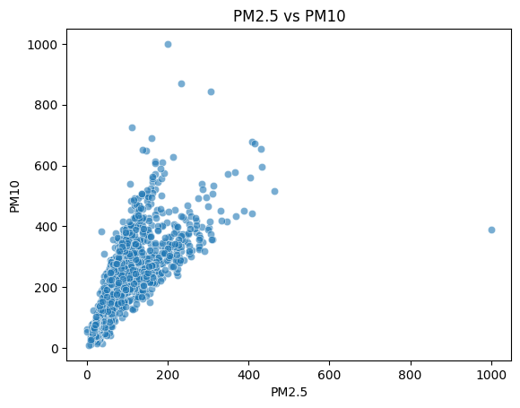
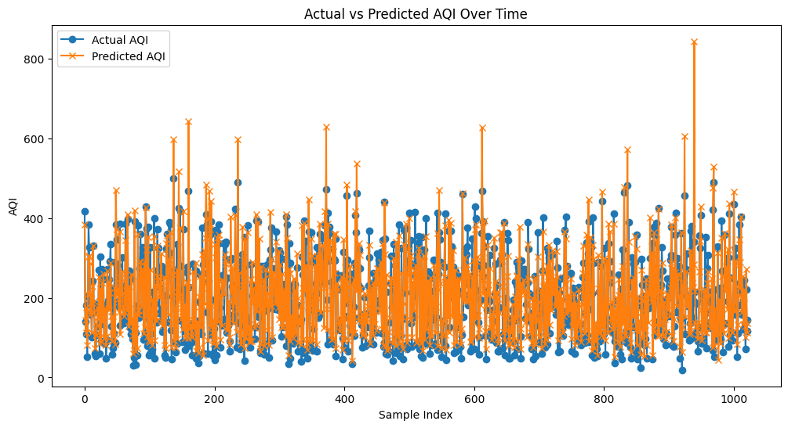
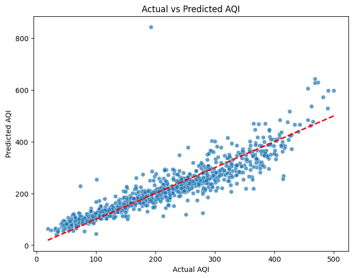

# Delhi Air Quality Analysis (PLP Assignment)

> Courtesy of PLP Assignment

## Project Overview

This repository contains an exploratory data analysis and a simple predictive model for air quality in Delhi. The analysis is implemented in the Jupyter notebook `delhi_airquality.ipynb` and uses the dataset `AIR_DELHI.xlsx`.

The goal of the project is to examine pollutant trends, understand seasonal and monthly patterns, visualize distributions and relationships between pollutants, and build a basic model to predict the Air Quality Index (AQI) from pollutant measurements.

## Dataset

- Filename: `AIR_DELHI.xlsx`
- Expected columns (as used by the notebook):
  - `Date` (datetime)
  - `PM2.5`, `PM10`, `NO2`, `SO2`, `CO`, `Ozone` (numeric pollutant measurements)
  - `AQI` (Air Quality Index, numeric)

Notes on the dataset used in the notebook:
- The notebook assumes `Date` is loaded as a pandas datetime (it uses `df['Date'].dt.month`). If your `Date` column is not parsed automatically, parse it explicitly when loading.
- Missing pollutant values are filled with the column mean .

## What the notebook does (high level)

1. Imports necessary libraries (pandas, numpy, matplotlib, seaborn, scikit-learn).
2. Loads the Excel dataset `AIR_DELHI.xlsx` into a DataFrame.
3. Checks and fills missing values for pollutant columns using the column mean.
4. Produces summary statistics (count, mean, std, min, max, quartiles) for pollutant columns and AQI.
5. Adds `Month` and `Season` columns (simple season mapping) and computes seasonal/ monthly averages.
6. Visualizes:
   - Monthly line plots for selected pollutants (PM2.5, PM10, AQI)
   - Bar chart of average AQI by month
   - Histograms of PM2.5 and AQI
   - Scatter plot of PM2.5 vs PM10
7. Builds a simple linear regression model to predict `AQI` using pollutant features, prints model performance metrics (R², MAE, RMSE) and plots Actual vs Predicted.

## Quick findings and observations

- The notebook includes initial observations such as which pollutant appears highest on average and a note that pollution tends to increase in summer months (based on grouping by month/season).
- The analysis is exploratory and intended for learning; model performance depends on the quality, quantity, and preprocessing of data.

Do not treat the model in the notebook as production-ready—it's a demonstration of linear regression on this dataset.

## Visualizations: See the Data in Action

Below are the main visualizations generated by the notebook. Each image is saved in the `output/` folder and shown here with a short, human-friendly explanation. These plots help you quickly grasp the story behind Delhi's air quality.

---

### Monthly Average Pollution Levels

*A multi-line chart showing how PM2.5, PM10, and AQI change month by month. This helps you spot seasonal pollution spikes and see which months are the cleanest or dirtiest.*

### Average AQI Across Months in Delhi

*A bar chart ranking months by their average AQI. Instantly see which months have the worst air quality and which are relatively better.*

### Distribution of PM2.5 Levels

*A histogram showing how PM2.5 values are spread across the dataset. Are most days moderate, or do you see lots of extreme pollution? This plot answers that.*

### Distribution of AQI Levels

*Similar to the PM2.5 histogram, but for AQI. It helps you understand how often Delhi experiences good, moderate, or poor air quality.*

### PM2.5 vs PM10

*A scatter plot showing the relationship between PM2.5 and PM10. If the points form a line, these pollutants rise and fall together—often a sign of common sources.*

### Actual vs Predicted AQI

*A scatter plot comparing the model's predicted AQI to the actual values. Points close to the diagonal mean the model is accurate; big gaps show where it struggles.*

### Actual vs Predicted AQI Over Time

*A line plot showing how predicted and actual AQI change over the test set. This helps you spot periods where the model consistently over- or under-predicts.*

---

If you don't see images, make sure the `output/` folder is present and the filenames match those above. You can open the notebook and re-run the cells to regenerate the images if needed.

## Reproducibility: how to run the notebook

1. Ensure you have Python 3.3+ installed.
2. Create and activate a virtual environment (PowerShell example):

```powershell
python -m venv .venv
.\.venv\Scripts\Activate.ps1
```

3. Install required packages:

```powershell
pip install pandas numpy matplotlib seaborn scikit-learn openpyxl jupyter
```

4. Open the notebook:

```powershell
jupyter lab # or jupyter notebook
```

5. In the notebook, run all cells. The notebook will load `AIR_DELHI.xlsx` from the same directory, perform EDA, display plots, and run the regression model.

## Dependencies

- pandas
- numpy
- matplotlib
- seaborn
- scikit-learn
- openpyxl (used by pandas to read Excel files)
- jupyter

Add these to a `requirements.txt` if you want reproducible installs:

```
pandas
numpy
matplotlib
seaborn
scikit-learn
openpyxl
jupyter
```

## Implementation details / code notes

- Missing values: the notebook fills missing pollutant values with the column mean. Mean imputation is simple but can bias results. Consider other imputation strategies for improved modeling (median, KNN, interpolation).
- Season mapping: the notebook maps months to three categories (Winter, Summer, Other). You may want to refine season definitions if required.
- Model split: the notebook performs a train/test split and trains a LinearRegression model. Verify the order/arguments passed to `train_test_split` (expected ordering is X_train, X_test, y_train, y_test or using named outputs from the function) — if results look odd, check how split return values were assigned.

## Contract (inputs / outputs / success criteria)

- Inputs: `AIR_DELHI.xlsx` with a `Date` column and pollutant/AQI numeric columns.
- Outputs: EDA plots, summary statistics printed in the notebook, and model performance metrics & plots saved to the notebook output.
- Success criteria: Notebook runs without errors and produces plots and model metrics.

## Edge cases and notes

- If `Date` is not parsed as datetime, the `Month` and `Season` columns will fail—ensure `pd.read_excel(..., parse_dates=['Date'])` or convert after loading.
- If the file `AIR_DELHI.xlsx` is missing or in a different path, update the path or place the file in the notebook directory.
- Non-numeric pollutant values will error out when computing means or training models; cast or clean data first.

## Credits

This project and notebook is dedicated to PLP ACADEMY. Use and modify as needed for learning and experimentation. AUTHORED BY CODE4CITIES(BRAVIN VULIMWA)

